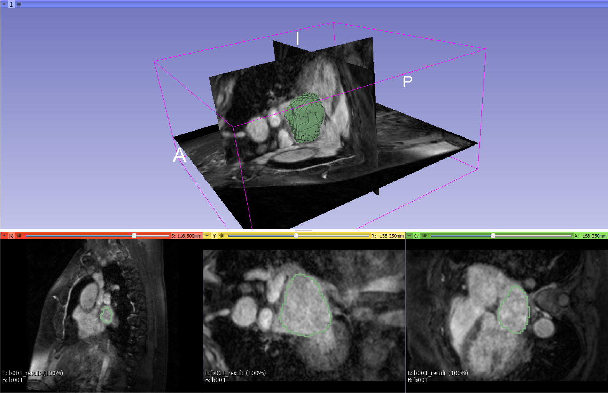

# CAFFEnd: A Caffe Extension for Data Sets in Any Dimensional Vector Space

Caffe (http://caffe.berkeleyvision.org/) is a famous deep learning framework made with expression, speed, and modularity in mind. It is developed by Berkeley AI Research (BAIR) and by community contributors. Yangqing Jia created the project during his PhD at UC Berkeley.

However, Caffe is lacking-off the supporting for data sets in higher dimensional data vector spaces. At beginning, Caffe was designed mainly for the research of deep learning in computer vision. As a result, the the majority of data modality is mainly 2D color and/or gray scale images, as it manages the input data in the fashion of (batch, channel, height and width). Hence, it limits the use cases of more than 2D. Although in recently, newer caffe components were designed to be compatible with higher dimensional data sets. However, Caffe itself is not ready yet for a dataset which consists of more than 2 or 3 dimensional data vectors.

On the other hand, in many modalities of biomedical images, the data sets are usually 3D or even higher. Unfortunately there are not many deep learning platforms available for data dimensions higher than 3D. Especially the famous deep learning platform: Caffe.

Although there are some PRs of Caffe providing the supporting for 3D or even ND data set compatibility. However, many of them are either out-of-date or difficult to be integrated. Thus, I decided to put my effort into making the Caffe compatible to arbitrary dimensional data sets for my personal interests.

This Caffe extension includes most of basic operations for deep learning for arbitrary dimensional data sets, including arbitrary dimensional convolution, arbitrary dimensional pooling (MAX and AVG), etc. I am continuously working on other layer types.

VNet, proposed by faustomilletare, is a 3D segmentaion approach (https://github.com/faustomilletari/VNet). This model is a good example for validating the proposed CAFFEnd.  

I will be more than happy to answer any question.
